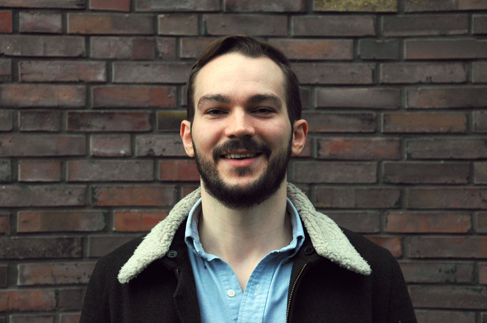

[//]: 

[//]: 

# Samuel Jones

Director's Fellow  
Computational Physics and Methods Group (CCS-2)  
CCS Division  
[Los Alamos National Laboratory](http://www.lanl.gov/)  
email: swjones at lanl.gov  

I am an astrophysicist and a [Director's
Fellow](http://www.lanl.gov/careers/career-options/postdoctoral-research/postdoc-program/postdoc-appointment-types.php)
in the [Computational Physics and Methods
(CCS-2)](http://www.lanl.gov/org/padste/adtsc/computer-computational-statistical-sciences/computational-physics-methods/index.php)
Group at [Los Alamos National Laboratory (LANL)](http://www.lanl.gov/) in New
Mexico, USA.

My research focuses on the evolution and explosion of stars and
the origin of the elements.

photo: _Peter Saueressig/HITS_
