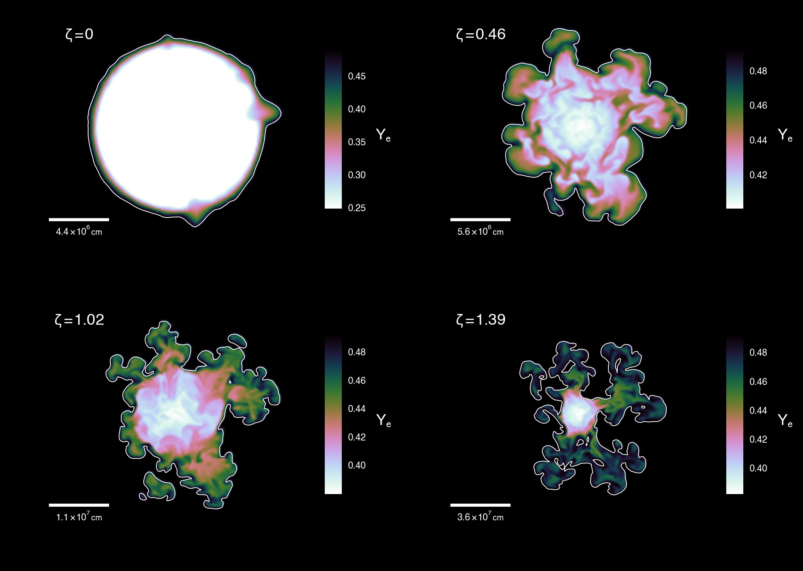

# Shellular average of model H01 from Jones et al. (2016) A&A 593, A72

[FILE: collapsing 1d model](../resources/H01a_ful.tar)

[FILE: figures](../resources/H01a_ful_figures.tar.gz)

The model with the highest ignition density -- H01 -- from Jones et al. (2016)
A&A 593, A72 results in core collapse. The simulation was conducted in 3D, in
4pi Cartesian geometry. However, in this simulation the growth of the
Rayleigh-Taylor instability is suppressed owing to the rapid deleptonization of
the ashes of the deflagration wave. Therefore, the model quickly becomes
pseudo-spherically symmetric.

You can download the model, which has been averaged down to 1d
[here](../resources/H01a_ful.tar). I have also fit the external structure of the 8.75
solar-mass super-AGB progenitor model from Jones et al. (2013) ApJ 772, 150. If
you don't want the envelope, either remove it or send me an email and I will
send you the structure without. I have also uploaded some PDF figures of the
structure [here](../resources/H01a_ful_figures.tar.gz).

If you use these data or images, please cite both Jones et al. (2013) ApJ 772,
150 and Jones et al. (2016) A&A 593, A72, or whichever is relevant.

To illustrate how close to spherical symmetry the collapsing model is, H01 is
the model in the top left of this figure from Jones et al. (2016) A&A 593, A72
, with flame asymmetry parameter 0 (i.e. very close to a sphere):

