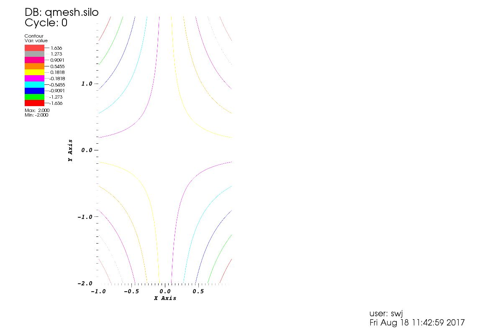

# Creating .silo files with [pyvisfile](https://mathema.tician.de/software/pyvisfile/)

[Silo](https://wci.llnl.gov/simulation/computer-codes/silo) is an I/O library
developed at [LLNL](https://www.llnl.gov/) for reading/writing scientific
information -- databases or simulation data, for example -- in a standardized
format that facilitates data exchange and interfacing of different software
tools. Silo files are also the default input format for the visualisation
program [VisIt](https://wci.llnl.gov/simulation/computer-codes/visit), which
was also developed at LLNL.

# Installation of pyvisfile and its dependencies

## Silo

First we need to install Silo, if it is not already installed.

If you are running __Debian/Ubuntu__ you can install the Debian package:

`$ sudo apt-get install libsiloh5-0 libsilo-dev libsilo-bin`

or if you are a __Mac__ user you can install Silo with
[homebrew](https://brew.sh/):

`$ brew install silo`.

Alternatively, if you prefer to build from source,  __you can download the
source [here](https://wci.llnl.gov/simulation/computer-codes/silo/downloads).__

Here's how I built from the source (of course, you will need to change the path
for where you want silo to be built and to point to the correct hdf5 `lib` and
`include` directories):

~~~bash
# set a Silo environment variable for ease later on
$export SILO=/home/swj/softs/silo/silo-4.10-bsd/build

# configure and build
$ ./configure --prefix=$SILO --enable-pythonmodule \
--with-hdf5=/usr/lib/x86_64-linux-gnu/hdf5/serial/include,/usr/lib/x86_64-linux-gnu/hdf5/serial/lib  
$ make  
$ make install
~~~

The software comes with a python module that is build if `configure` is given
the `--enable-pythonmodule` flag, as in the example above, which ends up in
`$SILO/lib`. The module seems to work but it has little documentation
(actually, I couldn't find any at all) and no doctrings, and does not appear to
have all of the functionality that I had expected. Instead, I opted to use
`pyvisfile` (which is actually recommended by the Silo developers as a superior
alternative to the python module that they provide).

`pyvisfile` requires, in addition to `silo`,  [Boost](http://www.boost.org) and
[PyUblas](https://mathema.tician.de/software/pyublas). Here's how to install
them, and finally, `pyvisfile`:


## Boost

PyUblas and pyvisfile require C++ libraries from [Boost](http://www.boost.org).

On __debian/ubuntu__ you can install the Boost Debian package:

`$ sudo apt-get install libboost-all-dev`

or if you're a __Mac__ user you can install using homebrew:

~~~bash
$ brew install boost
$ brew install boost-python
~~~

Alternatively, you could __build from the
[source](http://www.boost.org/users/download/)__, which I have not tried
myself.

## PyUblas

PyUblas is another utility by Andreas Kloeckner. It provides an interface
between [NumPy](http://www.numpy.org/) and
[Boost.Ublas](http://www.boost.org/doc/libs/1_45_0/libs/numeric/ublas/doc/index.htm)
(the Basic Linear Algebra Library provided by Boost) for use with
[Boost.Python](http://www.boost.org/doc/libs/1_64_0/libs/python/doc/html/index.html)
(a C++ library enabling interoperability of C++ and Python).

Firstly, we'll need to __clone Kloeckner's PyUblas repo__:

`$ git clone http://git.tiker.net/trees/pyublas.git`

Next, we need to __configure it with our Boost installation__.

>You'll notice that when I installed Boost on Mac using homebrew, I installed a
package called boost-python as well, that provides the library
`libboost_python`. For this reason and because I'm not a sudoer on my Mac
I had to configure PyUblas slightly differently on each machine, so I've just
included both options here
>

__debian__:

~~~bash
$ ./configure.py --python-exe=python --boost-inc-dir=/usr/include/boost \
--boost-lib-dir=/usr/lib/x86_64-linux-gnu/lib --boost-compiler=gcc
~~~

__Mac__:

~~~bash
$ export BOOST=/Users/swjones/softs/brew/Cellar/boost/1.64.0_1
$ ./configure.py --python-exe=python --boost-inc-dir=$BOOST/include \
--boost-lib-dir=$BOOST/lib --boost-compiler=gcc \
--boost-python-libname=boost_python
~~~

note that if you are still having trouble to compile, you can run `./configure
--help` to see the default configuration options, that may not be correct for
your system.

now we can __build and test PyUblas__:

```$ make```

__debian__:

~~~bash
$ sudo make install
$ cd test
$ python test_pyublas.py
~~~

__Mac__:

~~~bash
$ make install
$ cd test
$ python test_pyublas.py
~~~

## pyvisfile

Now we are ready to install [`pyvisfile`](https://github.com/inducer/pyvisfile).

Clone `pyvisfile` git repo:

`$ git clone git@github.com:inducer/pyvisfile.git`

and configure it, and then build (again, I have separated out configuration
options that I used on Debian vs Mac, but the differences are mostly
system-dependent rather than OS dependent):

__debian__:

~~~bash
$ ./configure.py --use-silo --silo-inc-dir=$SILO/include \
--silo-lib-dir=$SILO/lib --python-exe=python \
--boost-inc-dir=/usr/include/boost \
--boost-lib-dir=/usr/lib/x86_64-linux-gnu/lib --boost-compiler=gcc
$ make
$ sudo make install
~~~

__Mac__:

~~~bash
$ export BOOST=/Users/swjones/softs/brew/Cellar/boost/1.64.0_1
$ ./configure.py --use-silo --silo-inc-dir=$SILO/include \
--silo-lib-dir=$SILO/lib --python-exe=python \
--boost-inc-dir=$BOOST/include \
--boost-lib-dir=$BOOST/lib --boost-compiler=gcc \
--boost-python-libname=boost_python
$ make
$ make install
~~~

Again, note that if you are still having trouble to compile, you can run
`./configure --help` to see the default configuration options, which may not be
correct for your system.

Finally (depending on how you like to do/have done things), you may beed to append
pyvisfile and pyublas to your `PYTHONPATH`.


## creating silo files: examples

Andreas Kloeckner provides some useful
[examples](https://github.com/inducer/pyvisfile/tree/master/examples) in his
repository for pyvisfile for how to write silo files. Here is one that creates
a 2D mesh with some scalar quantity:

~~~python
# modified from original code by Matthieu Haefele (IPP, Max-Planck-Gesellschaft)

import numpy
import pyvisfile.silo as silo

f = silo.SiloFile("qmesh.silo", mode=silo.DB_CLOBBER)
coord = [
        numpy.linspace(-1.0,1.0,50),
        numpy.linspace(-2.0,2.0,100)
        ]

f.put_quadmesh("meshxy", coord)

value = coord[0][:,numpy.newaxis]* coord[1][numpy.newaxis,:]

f.put_quadvar1("value", "meshxy", numpy.asarray(value, order="F"), value.shape,
        centering=silo.DB_NODECENT)

f.close()
~~~

This seems to work wondefully, and I was able to load the new file `qmesh.silo`
straight into VisIt and make the contour plot below. Thank you very much
Andreas Kloeckner.



